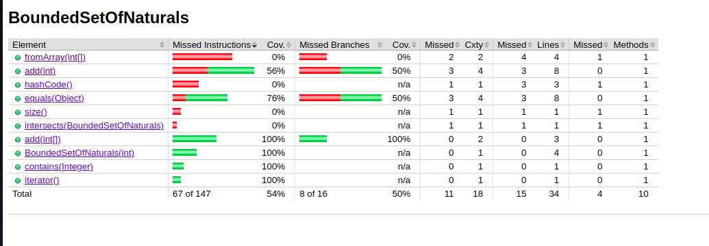
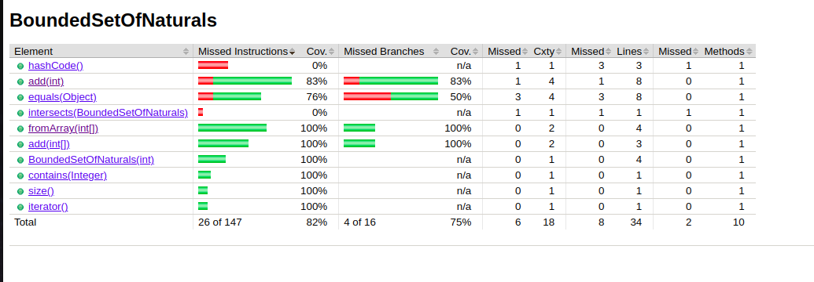

Notes for Exercise 2

##2b) 
Auto generated/imported code from well-know libraries doesn't require testing. BoundSetOfNaturals has a coverage of 54%.

##2c)
- Check for duplicates;
- Check for not natural numbers (try insertion of unallowed element)
- try to add past the allowed limit
- test each set operation!

##2d)

###Before

###After

Improved from 54 to 82%!