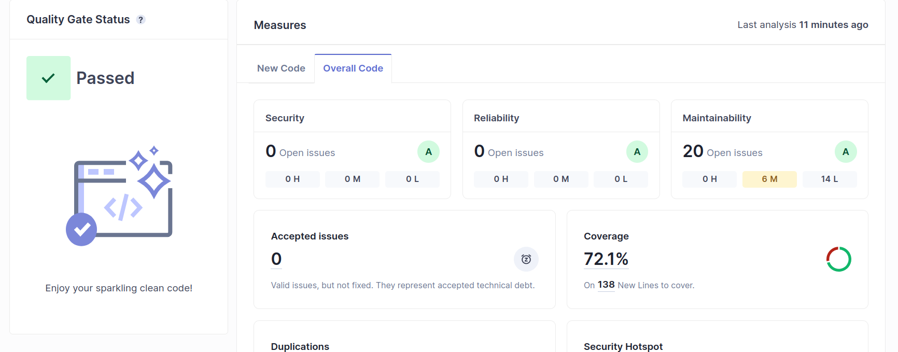
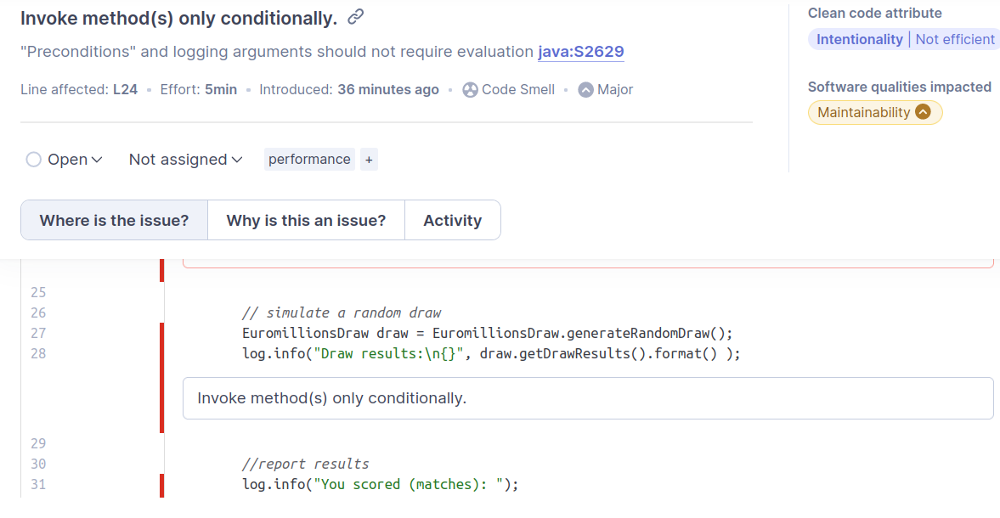

# Lab6 exercise 1

## e)

## Has your project passed the defined quality gate?

Yes. As shown in the image below, the project has passed the defined quality gate, thanks to a razoable test coverage and no serious issues, which is whats required by the default Quality gate.
To be known that 20 issues arised, some with relevant suggestions that i had not noticed before.

## f)

| Issue         | Problem Description            | How to Solve                  |
|---------------|--------------------------------|-------------------------------|
| Bug           | No problems found              | No action required            |
| Vulnerability | No problems found              | No action required            |
| Code Smells   | Unoptimized parameters parsing | Conditional method invocation |

