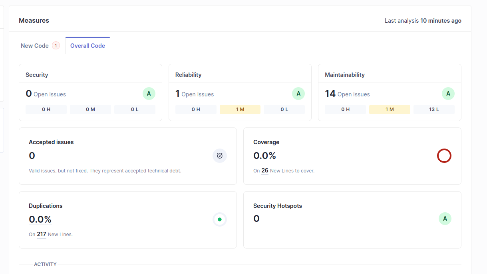
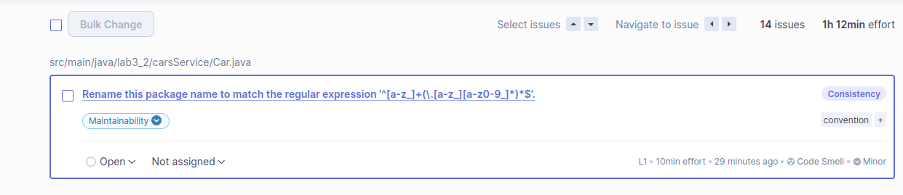
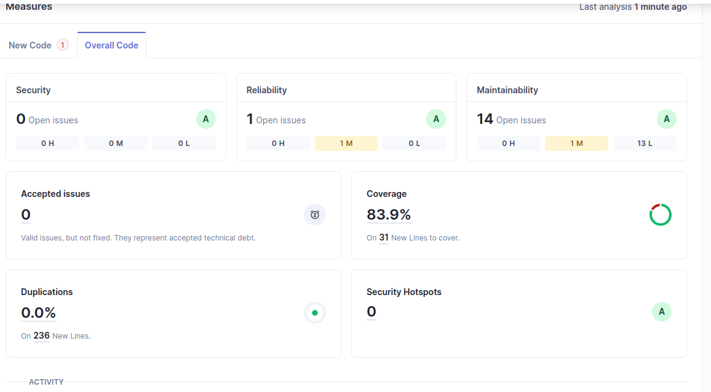

# Lab6 exercise 2

## a)

Found 14 issues, 1 medium priority and 13 low priority.

The presented technical debt is of 1h 12min. This represents an estimation of the time needed for the developer to fix the presented issues.

## c)

With jacoco, I found out we got a code test coverage of 83.9%.
This projects has 5 uncovered lines. The percentage of coverage is reasonable and all the components of interest have been duly tested. 
The project was analysed with the standard quality gate with 4 conditions.

Results after running with the jacoco plugin:

