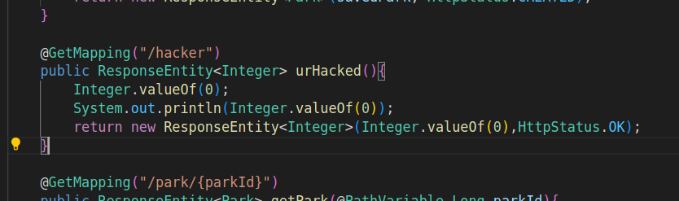

I've choosen the following quality gate:

But why? It's obvious this quality gate is quite permissive, and does not enforce any type of testing whatsoever... However, since IES's aim was not testing i've tweaked the specs to reflect that. So, we allow a limited number of issues on the new code, since its not being developed in a professional environment, and so, mistakes/issues are expected, and we only aim to block any type of critical issue.

## Initial Code Analysis

I decided to experiment and used sonar-scaner in a docker instance to check all the code (svelte, java and python) present in the project, at once.

As i've imagined there was not needed the introduction of any "bad smells", has we've already left plenty of them implemented :).

Please, dont be scared when looking at the following...

## Introduction of bad smells

I've added the following code:

After that, i've run one more analysis with the following result:

Note that now, the quality gate has not passed since the inserted code contain some serious issues...

## Final thoughts

This analysis help me understand the value that automation in testing and analysis brings to our code in terms not only of security but overall quality.
